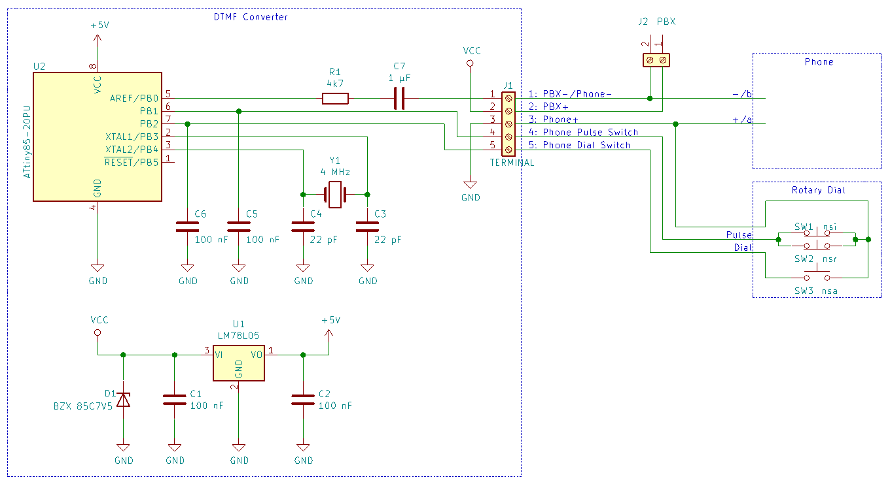

# rotarydial

This repository includes modifications from [borishim](https://github.com/borishim/rotarydial) of [Matthew Millman's](https://github.com/inaxeon/rotarydial) rotary-to-dtmf firmware, while Matthew's solution is based on a concept from [Boris Cherkasskiy](http://boris0.blogspot.com/2013/09/rotary-dial-for-digital-age.html).

So this project already has a long history and a lot of fathers - why add another one? Mainly because of the same reasons mentioned by Matthew: power supply and signal attenuation issues. The solution presented here requires a few changes to the concept. The circuit and firmware are therefore not fully backward compatible to the previous variants but easily adaptable. 

# Hardware construction

CPU: ATtiny85 with 4 or 8 MHz crystal

[Previous concept, schematics and more](http://tech.mattmillman.com/projects/building-your-own-pulse-to-tone-converter/)

# Development Environment

Arduino IDE 1.8.10

## Build

Repository:    http://drazzy.com/package_drazzy.com_index.json  
Board Manager: ATTinyCore 1.3.3 by Spence Konde  
Board:         ATtiny25/45/85 => EFUSE 0xFF  
Chip:          ATtiny85  
Clock:         4 MHz (external) => LFUSE 0xFD or 8 MHz (external) => LFUSE 0xFF  
B.O.D. Level:  disabled => bits 0..2 of HFUSE 0xDF  
Save EEPROM:   not retained => bit 3 of HFUSE 0xDF  

## ISP

You can use an Arduino as ISP to set the fuses ("Burn Bootloader") and to upload the firmware to the ATtiny85. Note that setting the fuses with the Arduino IDE will always erase the current firmware. Once the fuses are changed from internal to external clock you will need an oscillator for programming.

Example: https://create.arduino.cc/projecthub/arjun/programming-attiny85-with-arduino-uno-afb829

# Telephones

Some of the main target phones are:

* Matthew Millman's British model [GPO 746F](https://en.wikipedia.org/wiki/GPO_telephones#Type_746)
* borishim's Japanese model [600-A2](http://bunka.nii.ac.jp/heritages/detail/233568)
* jnsbyr's German model [W48](https://en.wikipedia.org/wiki/W48_\(telephone\))

# Application Notes

## Power Supply

I like the minimum component approach from Matthew but the original design from Boris will probably work with more phones, especially ones with microphones that have a low resistance, because Boris' circuit only needs 5 V instead of 7 V to operate. Analog land lines use a DC supply voltage between 20 to 75 V for remote power supply and an AC voltage between 30 to 90 V for ringing. These comparatively "high" voltages are used to handle the combined resistance of the phone and the land line up to 1700 ohms. The typical off-hook DC loop current is around 15 to 20 mA. With a phone resistance between 300 and 600 Ohms the off-hook DC voltage at the phone varies between 4.5 and 12 V. But the 78L05 requires at least 7 V input and this is not guaranteed to be available when the circuit is connected in parallel to the line. 

Matthew claims that his design does not attenuate the line signal but that is not true. You can hear the drop in the dial tone quite clearly when connecting the circuit to the line. Also the Z diode will clip the positive AC half waves and short the negative AC half waves, especially the ring voltage.

But if you connect the circuit in series to the phone, the power supply is no longer a problem as long as the available DC supply voltage is not overtaxed by the combination of phone and circuit. Also AC signals will no longer be clipped or shorted.

## Circuit Modification

When the circuit is connected in series to the phone one or two changes are needed to Matthew's circuit:

* the Z diode voltage must be lowered from 27 V to a value a little above the 7 V required by the 78L05 (e.g. 7.5 V)
* the ATtiny output should be AC coupled parallel to the line

The DC current loop between PBX and phone will not "close" at DC supply voltages of 35 V or lower if the Z diode voltage is not lowered significantly.

In Matthew's circuit the output signal is passed through the ATtiny and the 78L05 and is additionally blocked by the capacitors on the input and output of the 78L05. Depending on the input volume sensitivity of the PBX this might attenuate the signal too much to be still recognized.

I tested several alternative configurations of resistors, capacitors and transistors between the output and line/GND. In my configuration a resistor of 100 ohms and a capacitor of 10 µF in series between the ATtiny output and L+ of the circuit gave an acceptable result while all other variants attenuated or distorted the signal too much. It was also important to insert the circuit at the phone terminal where the plus pole of the DC supply voltage was connected. Inserting the circuit on the GND terminal of the phone also worked but then additional noise could be heard when dialing. Still the special function acknowledge beep tones where almost impossible to hear and some dial tones where not detected reliably by the PBX. 

The best solution was to insert the circuit at one phone terminal (in series to the phone) for optimum power supply and to connect the ATtiny output to the other phone terminal (parallel to the phone) for minimum output signal attenuation using a resistor of 4.7 kohms and a capacitor of 1 µF.

## Firmware

borishim made the following changes to the firmware from Matthew:

* Arduino IDE support
* external 8 MHz oscillator 
* software debouncing of the input pins
* special dial functions disabled
* reverse dialing support removed

I assume the software debouncing became necessary because Matthew experimented with low pass input filtering but effectively removed it in the end even though electromechanical contraptions like rotary dials are known to not work reliably without it. The software debouncing from borishim uses periodic sampling of the input pins every 100 µs and requires 300 µs level stability for a state change. borishim swapped the functions of PB1 and PB2 to wake up the ATtiny on dial start instead of at every pulse and the ATtiny is no longer powered down while dialing.

After comparing the code from Matthew and borishim it was possible to merge most features of both variants into a new version and add a few extras. The resulting firmware also includes a rework for saving the redial and speed dial numbers. In Matthew's firmware there is no last digit detection and consecutively dialed number separation (I did not perform any tests with the circuit - if it is somewhere in the code it is well hidden). Any additional digit dialed indefinitely later is added to the initial number and every time a digit is added to the number it is immediately saved in EEPROM again. Now a number will be saved after 4 seconds of dialing inactivity. When dialing manually the number is saved in RAM while a speed dial number is saved in EEPROM if it differs from the previously saved number. This should increase the lifespan of the EEPROM significantly. Dialing after the number was saved will start a new number. 

This is the feature list of the resulting firmware:

* Arduino IDE support (from borishim)
* internal or external 4 or 8 MHz oscillator (from Boris, borishim and me)
* software debouncing of the input pins (from borishim)
* special dial functions (from Boris)
* reverse dialing support (from Matthew)
* support \* and # for redial (from me)
* special dial function "cancel" (from me)
* save redial in RAM and speed dial in EEPROM after last digit was dialed (from me)
* place ATtiny output pin into high impedance mode when no tone is generated (from me)

## User Manual

The operation of the firmware is nearly identical to that of Matthew's, here is a summary:

* dial 0 .. 9        -> dial 0 .. 9
* dial \*            -> hold 1 for 2 seconds (beep), release
* dial #             -> hold 2 for 2 seconds (beep), release
* redial             -> hold 3 for 2 seconds (beep), release
* speed dial         -> hold 0 or 4-9 for 2 seconds (beep), release
* program speed dial -> hold 0 or 4-9 for 4 seconds (2 beeps), release, dial digits (beep), wait 4 seconds (beep), hangup
* cancel             -> hold 0 .. 9 for 6 seconds (beep), release

Redial and speed dial numbers can have up to 30 digits, but only redial supports \* and #. Redial repeats the last manually dialed number and is not affected by recalling a speed dial. The redial number is saved in RAM, the speed dial numbers are saved in EEPROM 4 seconds after the last dialed digit.

## Wiring Up a W48 Phone

* disconnect the 4 wires from the rotary dial to the phone panel and connect them directly to the circuit (pulse=yellow, dial=black, GND=white/green)
* add a bridge between contact screw (1) and (2') on the phone panel
* disconnect the land line cable from contact screw (a) on the phone panel to insert the circuit (PBX+, Phone+)
* connect the ATtiny output (PBX-/Phone-) to contact screw (b)

## Further Reading

Anyone interested in decoding the CLIP signal for callback should have a look at [this article](https://www-user.tu-chemnitz.de/~heha/basteln/Haus/Telefon/Impulswahl%E2%86%92DTMF/#2) from the technical university of Chemniz.

# License

The firmware is distributed under the GNU Public License which can be found at http://www.gnu.org/licenses/gpl.txt
